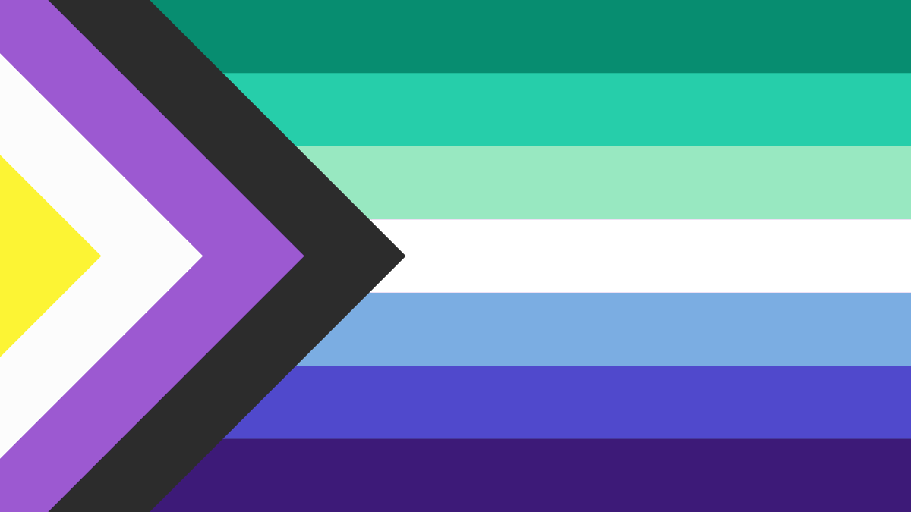

  

  <h1>Hi there, I'm queparadox! 🏳️‍🌈✨</h1>
  
<i>Building safe, inclusive, and colorful spaces on the internet.</i>

---

### 🌟 About Me

Welcome to my GitHub! I'm a developer

(they/them, non-binary, achillean) dedicated to creating projects, tools, and communities focused on LGBTQIA+ safety and
expression.

I believe the web should be a welcoming place for everyone to be their authentic selves. Through code, I aim to build
platforms that protect privacy, encourage creativity, and foster genuine connections within the queer community.

### 🛠️ What I'm Building

- **SafeQueer**: My current flagship project! It's a secure, real-time social platform featuring custom chat rooms,
  direct messaging, a massive collaborative pixel-art canvas (like `r/place`), and a **built-in profile builder that
  acts like a personal website editor**. Users can fully design their pages from scratch, add cute backgrounds, and
  create highly personalized layouts to express themselves. The platform is backed by robust moderation and
  anti-harassment tools.
    - 🏳️‍⚧️ **Live Demo**: The **Flag Generator** microservice for this ecosystem is currently live
      at [flag.safequeer.space](https://flag.safequeer.space)!

*(Note: To protect the security and privacy of the SafeQueer community, my core projects are currently closed-source.
That is why my profile looks a little quiet!)*

### 💻 My Tech Stack

- **Languages**: JavaScript, TypeScript, Python, SQL, HTML/CSS
- **Frontend**: React, Vite, TailwindCSS
- **Backend**: Node.js, Express, Socket.io
- **Databases**: SQLite, PostgreSQL
- **Focus Areas**: Real-time applications, web security, scalable microservices, and UI/UX design.

### 📬 Get In Touch

Even though my code isn't public, I'm always open to chatting about queer tech projects! Feel free to reach out to me at
**[queparadox@safequeer.space](mailto:queparadox@safequeer.space)** if you have a cool idea you'd like to build together
or want to collaborate.

---

  
<i>"It takes no compromise to give people their rights... it takes no money to respect the individual." - Harvey Milk</i>

